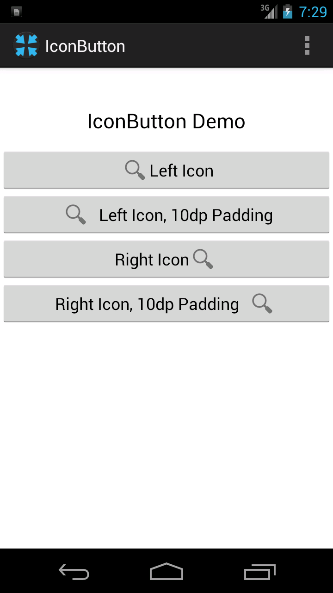

# IconButton for Android

IconButton is an Android button widget that allows you to center both the button's text and an icon.

Android's stock `Button` class allows you to assign a `Drawable` to the left, right, top, or bottom of a button, but it looks bad if you need to have the button fill the screen:

The component is a [Library Project](http://developer.android.com/guide/developing/eclipse-adt.html#libraryProject). This means that there's no need to copy-paste resources into your own project, simply add the cloned repository as a library reference.

## Installation

If you're using ADT, clone this repository and import it into your workspace using File - Import. Then add it to your project by right-clicking your project, selecting Properties, then Android, and adding IconButton in the references list at the bottom of the Properties window.

If you're not using ADT, I recommend using this library as a submodule:

    git submodule add git@github.com:pnc/IconButton.git

Generate a `local.properties` for IconButton:

    android update project -n IconButton --path IconButton/IconButton

Then reference the library from your own `project.properties`:

    android.library.reference.1=IconButton/IconButton

If you already have library references, change the `1` to the appropriate number.

## Usage

### In your layout

    <LinearLayout xmlns:android="http://schemas.android.com/apk/res/android"
        xmlns:app="http://schemas.android.com/apk/res/your.project.package"
        android:orientation="vertical"
        android:layout_width="fill_parent"
        android:layout_height="fill_parent"
    
    <!-- ... -->
    
      <com.phillipcalvin.iconbutton.IconButton
          android:id="@+id/search"
          android:drawableLeft="@drawable/action_search"
          android:text="@string/search"
          app:iconPadding="10dp" />

The use of `app:iconPadding` is optional. It allows you to add padding between the drawable and your text.

Change the text `your.project.package` to your own project's package. You don't have to use `LinearLayout`, but you do need to make sure to define the namespace definition (`xmlns:app="http://schemas.android.com/apk/res/your.project.package"`) appears in the root element.

You can assign either a `drawableLeft` or a `drawableRight` to the IconButton.

### Caveats

IconButton only supports one drawable on the left or right. I'll absolutely accept patches that improve its handling of multiple drawables.

## License
Copyright (c) 2012-2014 [Phil Calvin](http://philcalvin.com)

Licensed under the [Apache License, Version 2.0](http://www.apache.org/licenses/LICENSE-2.0.html)

Contains modified source from [ParcelHelper](https://github.com/commonsguy/cwac-parcel), also under the Apache License.

